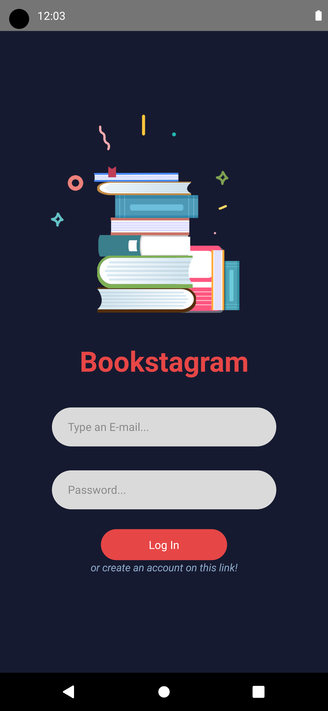
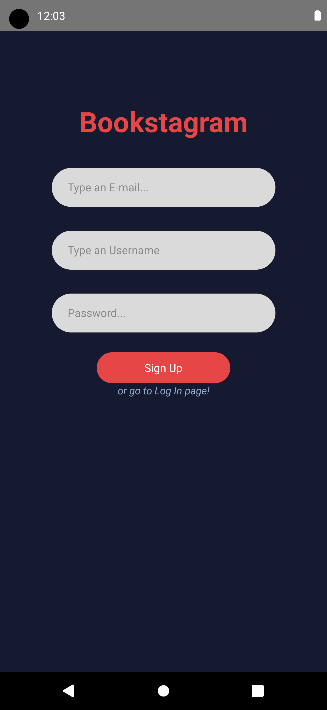
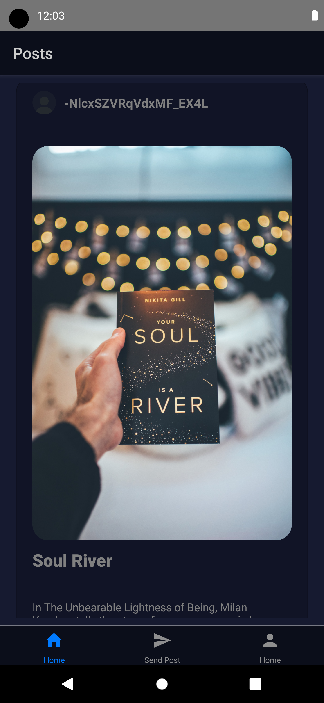
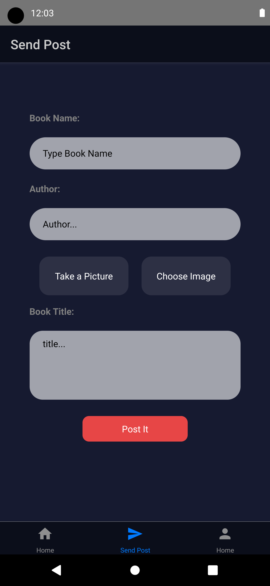
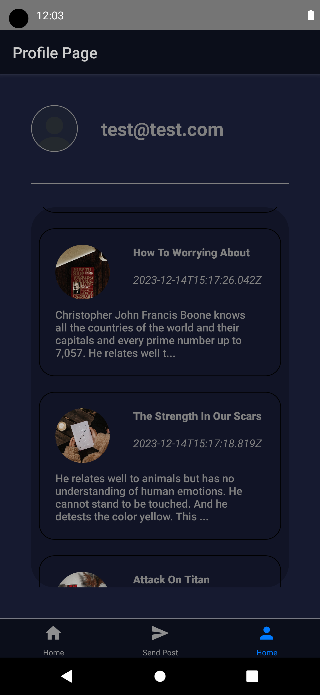

# Bookstagram App

## Step 1: Start the Metro Server

First, you will need to start **Metro**, the JavaScript _bundler_ that ships _with_ React Native.

```bash
# using npm
npx react-native start

# OR using Yarn
yarn start
```

## Step 2: Start your Application

Let Metro Bundler run in its _own_ terminal. Open a _new_ terminal from the _root_ of your React Native project. Run the following command to start your _Android_ or _iOS_ app:

### For Android

```bash
# using npm
npx react-native run-android

# OR using Yarn
yarn android
```

### For iOS

```bash
# using npm
npx react-native run-ios

# OR using Yarn
yarn ios
```
<div  style="display:flex">





</div>
## Packages

1. react-native-firebase/auth
2. react-native-firebase/database
3. react-navigation-native
4. react-navigation-native-stack
5. react-navigation-stack
6. react-navigation-bottom-tabs
7. reduxjs-toolkit
8. react-redux
9. react-native-image-picker
10. react-native-vector-icons
11. date-fns
12. formik
13. react-native-gesture-handler
14. react-native-flash-message
15. react-native-modal
16. use-http
17. react-native-config