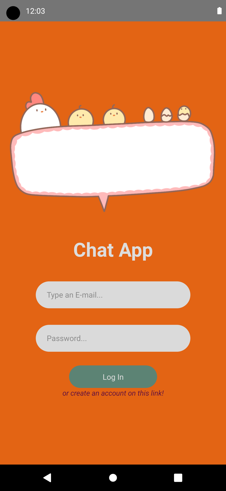
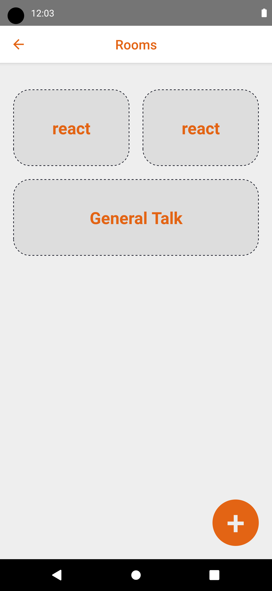
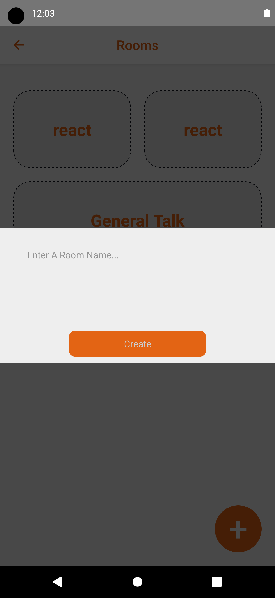
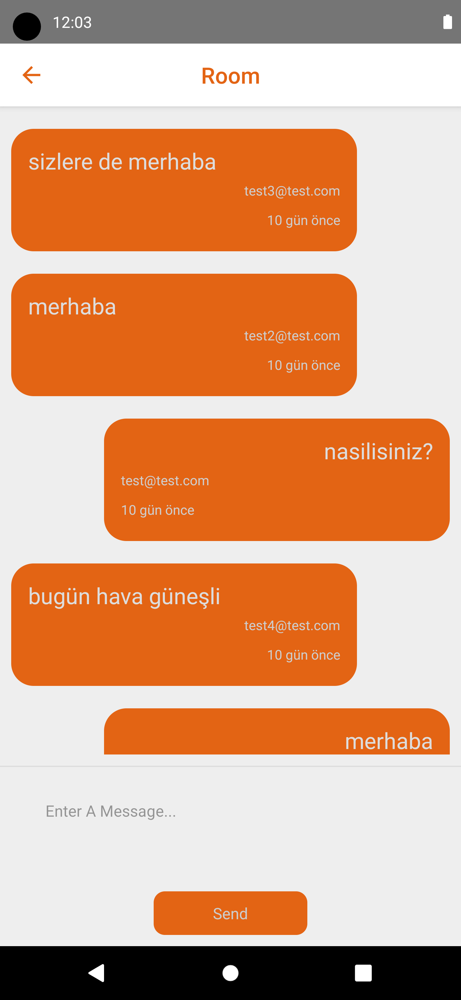

# Chat App

## Step 1: Start the Metro Server

First, you will need to start **Metro**, the JavaScript _bundler_ that ships _with_ React Native.

```bash
# using npm
npx react-native start

# OR using Yarn
yarn start
```

## Step 2: Start your Application

Let Metro Bundler run in its _own_ terminal. Open a _new_ terminal from the _root_ of your React Native project. Run the following command to start your _Android_ or _iOS_ app:

### For Android

```bash
# using npm
npx react-native run-android

# OR using Yarn
yarn android
```

### For iOS

```bash
# using npm
npx react-native run-ios

# OR using Yarn
yarn ios
```

<div style="display:flex"> 




</div>

## Packages

1. React-Native-Firebase-Auth
2. React-Native-Firebase-Realtime-DB
3. React-Navigation-Native
4. React-Navigation-Native-Stack
5. React-Navigation-Stack
6. Date-Fns
7. Formik
8. React-Native-Gesture-Handler
9. React-Native-Flash-Message
10. React-Native-Modal
